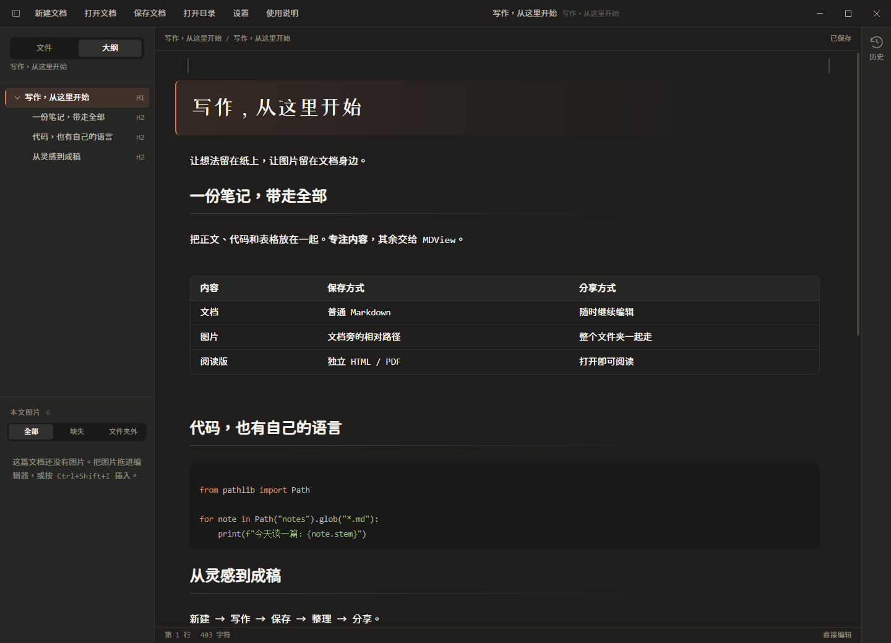

<div align="center">
  

# MDWisp

[English](README.md) · [简体中文](README.zh-CN.md)

**Start writing. Keep images with your document.**

A local Markdown desktop editor for writing, code notes and tables, with English and Simplified Chinese interfaces.

[Download](https://github.com/ArthurLauCS/MDView/releases/latest) · [AI skills](#ai-skills) · [Getting started](#getting-started) · [Changelog](CHANGELOG.md)

</div>

<picture>
  <source media="(prefers-color-scheme: light)" srcset="docs/images/editor-light.png" />
  
</picture>

Formerly **MDView**. The icon is unchanged. Existing settings, history, repository URLs and AI command identifiers remain compatible. The screenshots show the earlier Chinese interface.

## Features

| Write | Organize | Share |
| --- | --- | --- |
| Edit directly in formatted Markdown | Collapsible heading outline | Markdown, ZIP, HTML and PDF export |
| Adjustable margins and sidebar widths | Relative image paths beside the document | HTML with embedded images and fonts |
| Local code detection and explicit language selection | Version history, comparison and restore | Rules for Codex, Cursor and Claude Code |
| Dark/light themes and configurable fonts | Table editing, sorting, statistics and transpose | Ordinary files that work in other editors |

## Download and installation

Download `MDWisp-0.2.0-setup.exe` from [Releases](https://github.com/ArthurLauCS/MDView/releases/latest), or build it with `npm run dist`. Installation offers English and Simplified Chinese, a directory choice and a desktop shortcut. Installers are currently unsigned; macOS and Linux have not been verified.

`MDWisp-AI-skills-0.2.0.zip` provides AI rules without installing the app. Copy `en/.agents` into a project for English rules, or `.agents` for Simplified Chinese. Check downloaded files against `SHA256SUMS.txt` from the release.

## Getting started

1. Start typing immediately. **Ctrl+N** creates a document in a new window; **Ctrl+O** opens one in a new window.
2. **Ctrl+S** chooses a name and location on first save. Canceling keeps the draft. Untitled drafts have no autosave or snapshots and must be saved before quitting.
3. Save before pasting, dropping or inserting images. Images are copied beside the document with relative links and listed in the sidebar.
4. Organize a loose file into a document folder, then use **Ctrl+Shift+E** to export.

New documents, opened files and repeated shortcut launches use independent windows, preserving the current document and its unsaved edits. After the first save, autosave and history follow **Settings → Documents & saving**. Closing a window offers Save, Don't save and Cancel for unsaved edits. A failed save keeps that window open. A stale save cannot overwrite changes made by another window.

## Language and links

Choose **Settings → Appearance & fonts → Interface language** for **English** or **简体中文**. The choice applies immediately and persists across restarts without translating document content or resetting the editor.

Use **Ctrl+click** to follow links; use Cmd on macOS. Holding the modifier displays a hand cursor over links. Relative Markdown files open in a new app window, heading anchors navigate within the current document, websites open in the default browser and email links use the mail handler. Reference links, table links and linked images are supported. Ordinary clicks remain editing actions.

```markdown
[English](README.md) · [简体中文](README.zh-CN.md)
[Website](https://example.com)
[Section](#getting-started)
```

`[English]\(README.md)` escapes the parenthesis and is literal text, not a Markdown link. See the [syntax support matrix](docs/markdown-support.md) for supported syntax and limitations.

## Portable document folders

```text
Notes/
├── Notes.md
└── Notes_img/
    └── architecture.svg
```

```markdown

```

The folder name, Markdown filename and `_img` prefix match. Omit the image folder when there are no images. Share the entire document folder so images remain available on another machine.

**Organize into a document folder** previews local images, missing references and optional remote downloads. Keep the original or move it to the recycle bin. Code examples remain unchanged. ZIP export requires a document folder so unrelated files are not archived.

## Code, tables and history

Code fences use an explicit language or local rule-based detection without network access. Uncertain results remain plain text.

Click table cells to edit. Toolbar, context menu and palette actions support rows, columns, alignment, sorting, statistics, merging and conversion. Some registered actions remain unavailable; see [project status](docs/STATUS.md).

History opens beside the editor. Inspect snapshots, compare changes, record a snapshot or restore a version. Restoration saves the current content first and can be undone. Deleting snapshots or clearing history is permanent. History is stored in application data, outside shared document folders.

## Export

| Format | Result |
| --- | --- |
| Plain Markdown | Removes local images and paths according to the image policy, with a preview |
| ZIP | Archives saved files in the document folder without rewriting links |
| HTML | A self-contained file with local images and fonts embedded |
| PDF | A4 pages with embedded local images |

## AI skills

The `doc` skill creates portable document folders; `share` previews and removes local images and paths for a standalone file. All clients use the [plugin rule sources](plugin/mdview/skills), with English companion rules included.

In **Help → Rules for AI assistants**, choose a project to install skills for Codex and Cursor. Existing project instructions are preserved. Conflicting skill files must be backed up before replacing them. The selected interface language determines the installed rules' language.

| Client | Write | Share |
| --- | --- | --- |
| Codex | `$mdview-doc Write a user guide` | `$mdview-share Export standalone Markdown` |
| Cursor | `/mdview-doc Write a user guide` | `/mdview-share Export standalone Markdown` |

Skills install in `.agents/skills/mdview-doc/` and `.agents/skills/mdview-share/`. These identifiers remain compatible with the former MDView name. Alternatively copy `en/.agents` from the AI skills archive into your project as `.agents`; for all projects, use `~/.agents/skills/` and preserve custom modifications.

For Claude Code, use the app's **Copy install command**, or run from a checkout:

```bash
claude plugin marketplace add ./plugin
claude plugin install mdview@mdview
```

Use `/mdview:doc` or `/mdview:share` in a new session. Validate generated folders with Node.js:

```bash
node .agents/skills/mdview-doc/scripts/check.mjs "./Notes"
```

## Shortcuts

| Action | Shortcut | Action | Shortcut |
| --- | --- | --- | --- |
| New document | Ctrl+N | Open document | Ctrl+O |
| Save | Ctrl+S | Export | Ctrl+Shift+E |
| Command palette | Ctrl+P | Settings | Ctrl+, |
| History | Ctrl+H | Code block | Ctrl+Shift+C |
| Insert image | Ctrl+Shift+I | Toggle sidebar | Ctrl+\ |
| Undo | Ctrl+Z | Redo | Ctrl+Shift+Z / Ctrl+Y |

Press **F1** for the searchable list. Table, code and image commands depend on focus. App commands such as Export remain available while panels are open.

## Development and verification

Built with Electron, React, TypeScript, CodeMirror 6 and markdown-it. Use Node.js 22 LTS, npm and Git. Build Windows installers on Windows.

```bash
npm ci
npm run dev
npm test
npm run typecheck
npm run dist
```

Real Electron regressions use isolated profiles and document copies:

```bash
npm run build
npx electron scripts/shoot.cjs design-review/round-N
npx electron scripts/links-i18n-check.cjs design-review/round-links-i18n-N
npx electron scripts/code-block-menu-check.cjs design-review/code-block-menu-N
npx electron scripts/shortcuts-layout-check.cjs design-review/shortcuts-layout-N
node scripts/packaged-check.cjs design-review/packaged-N
claude plugin validate plugin
```

See [AGENTS.md](AGENTS.md) for development rules. Report issues in the existing [GitHub repository](https://github.com/ArthurLauCS/MDView/issues).

## License and fonts

Code uses [MIT](LICENSE). Bundled fonts retain their open licenses: [GenSen Rounded](src/renderer/public/OFL-GenSen.txt) and [ZCOOL XiaoWei](src/renderer/public/OFL-ZCOOLXiaoWei.txt).
