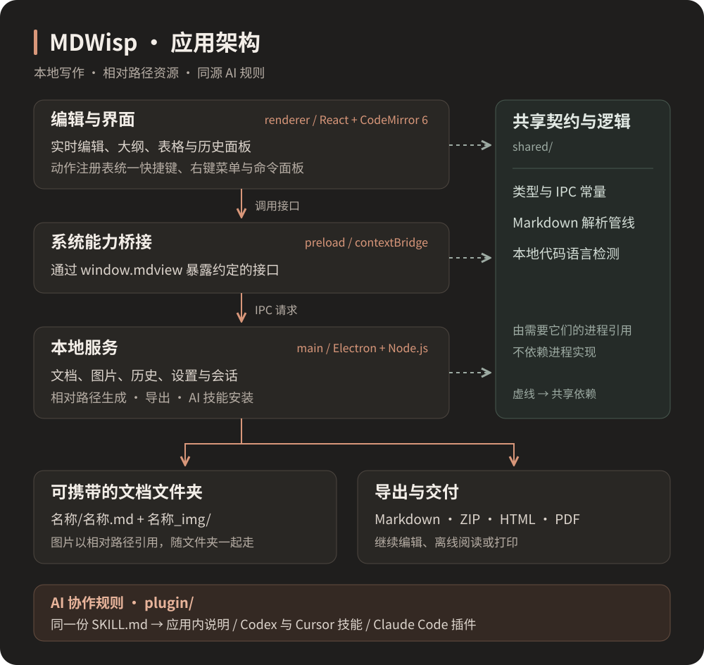

<div align="center">
  

# MDWisp

[English](README.md) · [简体中文](README.zh-CN.md)

**打开就写，图片随文档一起走。**

一款支持简体中文和 English 的 Markdown 桌面编辑器，面向写作、代码笔记与表格。

原名 MDView，图标保持不变。旧设置与历史记录继续使用，仓库名称与新安装的 AI 技能统一使用 MDWisp。

[](https://github.com/ArthurLauCS/MDWisp/releases/latest)

[](LICENSE)

[下载应用](https://github.com/ArthurLauCS/MDWisp/releases/latest) · [安装 AI 插件](#安装-ai-插件) · [开始写作](#开始写作) · [更新记录](CHANGELOG.md)

</div>

<picture>
  <source media="(prefers-color-scheme: light)" srcset="docs/images/editor-light.png" />
  
</picture>

## 为写作留出空间

| 写作 | 整理 | 交付 |
| :--- | :--- | :--- |
| 在排版后的正文中直接编辑 | 按标题层级折叠和跳转的大纲 | Markdown、ZIP、HTML、PDF 导出 |
| 正文宽度、边距和侧栏可拖动调整 | 图片使用相对路径，跟随文档保存 | HTML 内嵌图片与字体，便于离线阅读 |
| 代码语言自动检测，也可手动选择 | 右侧历史面板，查看差异与恢复版本 | Codex、Cursor、Claude Code 协作规则 |
| 深浅主题，中文圆体与等宽代码字体 | 表格编辑、排序、统计与转置 | 本地文件，可用其他编辑器继续打开 |

## 下载与安装

前往 **[Releases](https://github.com/ArthurLauCS/MDWisp/releases/latest)**，下载 `MDWisp-0.3.5-setup.exe`，也可通过 `npm run dist` 自行构建。安装时可以选择中英文、安装目录，并创建桌面快捷方式。

当前提供 **Windows x64** 安装包；macOS 和 Linux 尚未验证。安装包暂未进行代码签名。

只需要 AI 协作规则，可以下载同一发行版中的 `MDWisp-AI-skills-0.3.5.zip`，无需安装桌面应用。中文规则位于 `.agents`，英文规则位于 `en/.agents`；选择一份复制到项目根目录。`SHA256SUMS.txt` 提供下载文件的校验值。

## 语言与链接

按 **Ctrl+F** 查找当前文档，**Ctrl+H** 打开替换。支持逐个替换、全部替换、区分大小写、全字和正则匹配；**F3 / Shift+F3** 切换匹配，**Esc** 关闭。查找和替换保持排版预览，表格、链接目标、图片路径及隐藏标记中的匹配仍有可见提示。替换可以撤销，只读文档只能查找。历史版本快捷键为 **Ctrl+Alt+Y**。

在「设置 → 外观与字体 → 界面语言」中切换简体中文和 English，即时生效并在重启后保留，不会翻译文档内容。

按住 **Ctrl 点击**链接跳转；macOS 使用 Cmd。按住时链接显示手形指针。相对 Markdown 文档在新窗口打开，当前文档内的锚点在原窗口定位。支持网址、邮箱、参考式链接，以及表格中的链接。普通点击仍用于编辑。`[English](README.md)` 是链接；`[English]\(README.md)` 是转义后的普通文本。

语法覆盖和现有限制见 [Markdown 支持情况](docs/markdown-support.md)。

## 开始写作

1. **打开就写。** 启动后直接输入，`Ctrl+N` 在新窗口新建，`Ctrl+O` 在新窗口打开已有文档。
2. **第一次保存再选位置。** `Ctrl+S` 选择文件名和目录；取消保存仍保留当前内容。未命名草稿不自动保存、不生成历史快照。
3. **图片跟着文档走。** 保存文档后，粘贴、拖入或插入图片；应用复制图片并生成相对路径。本文图片集中在左侧栏底部。
4. **整理与分享。** 可将散装 Markdown 整理成文档文件夹，再按 `Ctrl+Shift+E` 导出。

新建、打开文档和再次双击应用快捷方式都会打开独立窗口，保留当前文档与未保存内容。关闭窗口时可选择保存、不保存或取消；保存失败会保留该窗口。保存时会检查文件是否已被其他窗口修改，避免覆盖。

保存后的自动保存和历史记录由「设置 → 文档与保存」控制。未命名草稿不会在退出后恢复，关闭前请保存。

输入三个反引号后按回车即可开始代码块，无需先填写语言。悬停或在代码块内编辑时显示语言选择器；点击代码块下方可以继续写正文。正文两侧边距可直接拖动，双击恢复默认。

## 文档与图片，一起保存

MDWisp 使用普通文件，推荐每篇文档独占一个文件夹：

```text
我的笔记/
├── 我的笔记.md
└── 我的笔记_img/
    ├── 架构图.svg
    └── 操作截图.png
```

图片引用始终相对于 Markdown 文件：

```markdown

```

下面的 MDWisp 应用架构图就是这个相对路径的实际图片：


把整个文件夹拷走，图片仍然可用。整理前可预览变更，并选择是否保留原文件。

| 格式 | 适合什么场景 |
| :--- | :--- |
| Markdown | 继续编辑；纯文本导出，可在导出面板预览图片等内容的处理方式 |
| ZIP | 携带完整文档文件夹及图片，交给他人继续编辑 |
| HTML | 单文件离线阅读，内嵌图片、样式与字体 |
| PDF | 固定版式阅读与打印 |

## 安装 AI 插件

提供两项能力：**doc** 生成符合文档文件夹格式的文档，**share** 预览并移除本地图片与链接，整理可单独分享的 Markdown。三种客户端使用[同一份规则](plugin/mdwisp/skills)，无需分别维护提示词。

可要求「不生成图片」或「尽量生成图片」；实际图片生成能力取决于所用客户端已连接的工具。

### Codex 与 Cursor：通过应用安装

1. 在 MDWisp 中打开 **使用说明 → 给 AI 的协作规则**。
2. 找到 **Codex / Cursor**，点击 **安装到项目**。
3. 选择准备写文档的项目文件夹。
4. 在 Codex 或 Cursor 中打开同一文件夹，开始新会话；若未出现技能，重启客户端。

安装后目录如下。安装器会保留已有自定义内容，遇到不同版本时提示先备份处理。

```text
你的项目/
└── .agents/
    └── skills/
        ├── mdwisp-doc/
        │   ├── SKILL.md
        │   └── scripts/check.mjs
        └── mdwisp-share/
            └── SKILL.md
```

| 客户端 | 创建文档 | 整理交付 |
| :--- | :--- | :--- |
| Codex | `$mdwisp-doc 为这个项目写一份使用手册` | `$mdwisp-share 整理可分享的单文件 Markdown` |
| Cursor | `/mdwisp-doc 为这个项目写一份使用手册` | `/mdwisp-share 整理可分享的单文件 Markdown` |

**不使用桌面应用：** 解压发行版中的 AI 技能包，将 `.agents` 文件夹复制到项目根目录。如果目标已有同名技能，先比较内容，保留自己的修改。希望所有项目可用，可将两个 `mdwisp-*` 文件夹放入用户目录 `~/.agents/skills/`。

这里使用客户端的本地 Agent Skills 支持；它不依赖应用商店上架。路径与加载方式见 [Codex Skills 文档](https://learn.chatgpt.com/docs/build-skills)和 [Cursor Skills 文档](https://cursor.com/docs/skills)。

### Claude Code：从 GitHub 安装

在终端执行：

```bash
claude plugin marketplace add ArthurLauCS/MDWisp
claude plugin install mdwisp@mdwisp
```

在新的 Claude Code 会话中使用：

```text
/mdwisp:doc 为这个项目写一份使用手册
/mdwisp:share 整理可分享的单文件 Markdown
```

也可以在 MDWisp 的「给 AI 的协作规则」中，点击 Claude Code 的 **复制安装命令**，把命令粘贴到 Claude Code 会话中，使用随应用分发的本地插件。

如果已下载源码或 AI 技能包，在解压目录运行：

```bash
claude plugin marketplace add ./plugin
claude plugin install mdwisp@mdwisp
```

用 `claude plugin list` 检查安装结果。旧版 `mdview` 技能不会被自动删除；请按上面的命令安装新版 `mdwisp` 插件。此处指 **Claude Code** 的插件系统；安装机制见 [Claude Code 插件市场文档](https://code.claude.com/docs/en/plugin-marketplaces)。

### 检查 AI 生成的文档

校验脚本需要 Node.js，无需安装依赖。在安装技能的项目根目录运行：

```bash
node .agents/skills/mdwisp-doc/scripts/check.mjs "./我的笔记"
```

从源码或 AI 技能包运行时，也可使用 `plugin/mdwisp/skills/doc/scripts/check.mjs`。它会检查文件夹命名、Markdown 主文件及图片引用等约定。

## 常用快捷键

| 操作 | 快捷键 | 操作 | 快捷键 |
| :--- | :--- | :--- | :--- |
| 新建文档 | `Ctrl+N` | 打开文档 | `Ctrl+O` |
| 保存 | `Ctrl+S` | 导出 | `Ctrl+Shift+E` |
| 命令面板 | `Ctrl+P` | 设置 | `Ctrl+,` |
| 历史版本 | `Ctrl+Alt+Y` | 插入代码块 | `Ctrl+Shift+C` |
| 插入图片 | `Ctrl+Shift+I` | 显示 / 隐藏侧栏 | `Ctrl+\` |
| 撤销 | `Ctrl+Z` | 重做 | `Ctrl+Shift+Z` / `Ctrl+Y` |

按 `F1` 查看按功能分类的完整列表。格式和表格操作取决于当前编辑位置；导出等应用级快捷键在设置、历史等面板获得焦点时仍可使用。

## 开发与验证

基于 Electron、React、TypeScript、CodeMirror 6 和 markdown-it。准备 Node.js 22 LTS、npm 与 Git；Windows 安装包在 Windows 环境构建。

```bash
npm ci
npm run dev          # 本地开发
npm test             # 单元测试
npm run typecheck    # 主进程与渲染进程类型检查
npm run dist         # 构建 Windows NSIS 安装包，输出到 release/
```

交互回归使用真实 Electron 窗口和隔离的临时文档：

```bash
npm run build
npx electron scripts/shoot.cjs design-review/round-N
npx electron scripts/links-i18n-check.cjs design-review/round-links-i18n-N
npx electron scripts/code-block-menu-check.cjs design-review/code-block-menu-N
npx electron scripts/shortcuts-layout-check.cjs design-review/shortcuts-layout-N
node scripts/packaged-check.cjs design-review/packaged-N
claude plugin validate .
claude plugin validate plugin
```

0.2.0 已通过 420 个单元测试、类型检查、71 个快捷键、多窗口与编辑交互回归，并验证打包应用的四种导出和技能安装。剩余的 14 个无快捷键表格动作及其他限制记录在[项目状态](docs/STATUS.md)。问题反馈请使用 [Issues](https://github.com/ArthurLauCS/MDWisp/issues)。

开发约定见 [AGENTS.md](AGENTS.md)：系统能力通过 preload 暴露；资源路径集中处理；快捷键、右键菜单与命令面板共享动作注册表。

## 许可证与字体

应用代码采用 [MIT License](LICENSE)。内置字体使用各自的开源授权，授权文本随源码与安装包分发：[源泉圆体](src/renderer/public/OFL-GenSen.txt)、[站酷小薇体](src/renderer/public/OFL-ZCOOLXiaoWei.txt)。
