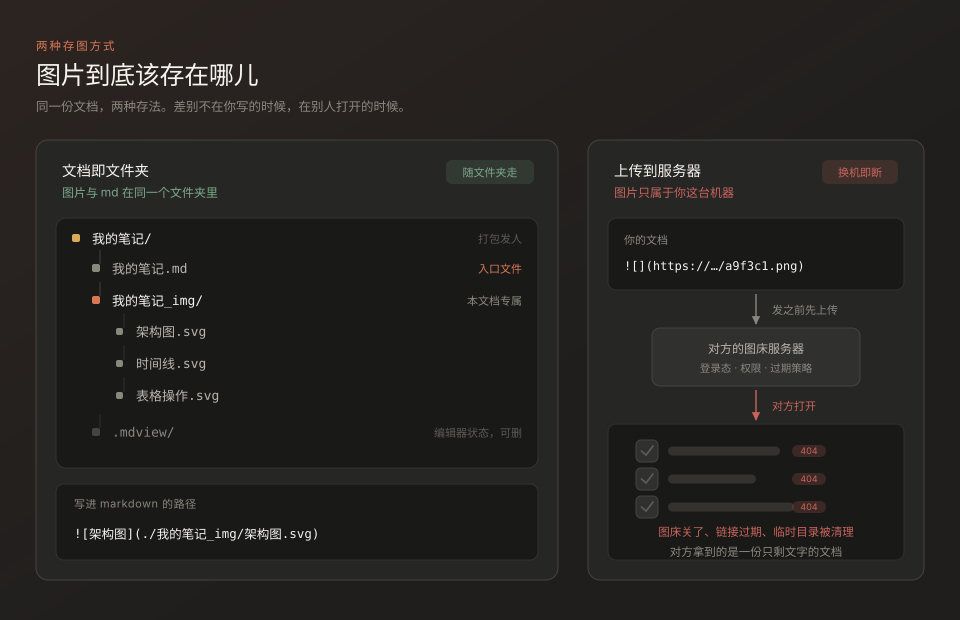

# 图片应该跟着文档走

MDWisp 原名 MDView，图标、已有设置和历史记录保持兼容。在「设置 → 外观与字体 → 界面语言」中可即时切换简体中文与 English，重启后仍保留选择，文档原文不变。

按住 **Ctrl 点击链接**跳转（macOS 使用 Cmd）：网址使用默认浏览器，相对 Markdown 文件在应用内打开，`#标题` 跳转到文内标题。表格和参考式链接使用同一交互；普通点击仍用于编辑。注意 `[English](README.md)` 是链接，`[English]\(README.md)` 是转义文本。

## 从空白页开始写作

首次打开 MDWisp 即可输入；点击「新建文档」或按 `Ctrl+N` 开始另一篇。未命名草稿只存在内存中，不会自动保存，也不会定时记录历史。

按 `Ctrl+S` 首次保存时再选择文件名和位置。取消会保留内容；保存失败会显示错误并留在当前文档。首次保存后，自动保存与快照才按你的设置工作；关闭自动保存时需要手动保存。

`Ctrl+O` 可以直接打开单个 Markdown 文件。「打开目录」用于浏览一组文件，不是开始写作的前提。新建、切换文档或退出时，未保存内容会询问「保存 / 不保存 / 取消」。未保存的内存草稿在退出后不能恢复。

本地图片需要先确定文档位置，所以插图前先保存文档；之后图片会跟随文档文件夹。主界面的「设置」独立管理外观、字体、保存、编辑器和图片，快捷键集中在其中按功能分类，按 `F1` 可直接进入。

点击左侧大纲可将对应标题移到编辑区顶部。侧栏边界可拖动，双击恢复默认宽度。

正文和图片随窗口宽度自适应。正文两侧的细线可分别拖动调整边距，双击恢复默认，松手即记住，无需进入设置。设置、历史和命令面板打开时，`Ctrl+Shift+E` 仍可切换到导出。

## 文档与图片一起保存

你大概遇到过这种情况：收到一份写得很好的 Markdown，打开一看，正文都在，图片全是破图框。

这不是对方粗心。多数编辑器插入图片时，会把文件放到它自己的一个中心目录里，或者干脆传到服务器上，然后往你的文档里写一条指向那里的路径。文档本身是完整的，但它依赖一个只有作者那台机器、那个账号才有的地方。文档一旦离开原地，图片就留在了原地。



MDWisp 把这件事反过来做：**一份文档就是一个文件夹**。图片放在文档旁边、属于这份文档的 `_img` 目录里，markdown 里写的是相对路径。你要分享，就把整个文件夹打包发出去——对方解压、双击 `.md`、图片全在。不需要服务器，不需要账号，不需要对方装同一个软件。

这一条不是靠自觉维护的约定，是代码强制的规则。它决定了这个项目其余部分的形态：路径怎么写、导出怎么做、重命名时哪些东西要跟着搬。

## 一个文件夹长什么样

```
我的笔记/                    ← 打包发出去的就是它
├── 我的笔记.md              ← 入口文件
├── 我的笔记_img/            ← 这份文档专属的资源
│   ├── 架构草图.svg
│   └── 时间线.svg
└── .mdview/                 ← 编辑器私有状态，删掉也不影响阅读
```

markdown 里写的是这样一行：

```markdown

```

注意开头的 `./` 和正斜杠。Windows 上写反斜杠，到了 macOS 或 Linux 上会被当成转义字符，链接就断了。这个细节在 `paths.ts` 里被统一处理：所有资源路径都必须经过 `buildRelativePath`，它会拒绝绝对路径、拒绝盘符、拒绝 `file://`，分隔符一律转成 `/`。想绕过去都绕不过去，因为没有第二个地方能生成路径。

> 判断一个功能做对没有，只需要问一句：这个文件夹拷到另一台机器上，链接还成立吗？不成立就是 bug。

### 重命名会带着图片一起走

把 `我的笔记.md` 改成 `读书笔记.md`，`我的笔记_img/` 会跟着改名，文档里所有引用也会一起重写。否则文件夹就不再是自包含的了——这正是"文档即文件夹"最容易被破坏的地方。

## 代码块不写语言也能高亮

大多数编辑器要求你在开头写上语言名，比如 ` ```python `。写文档的时候，这往往是最容易忘的一步。

MDWisp 的做法是本地判定，不联网、不调用任何模型，纯规则，因此瞬时且离线可用。三层管线，从高置信到低置信：


1. **独占指纹** —— 只可能属于一种语言的特征，命中就锁定，不再往下算。`#!/usr/bin/env bash`、`<?php`、`<!DOCTYPE html>`、`package main` 配 `func main()` 都属于这一类。
2. **加权评分** —— 每条规则分强信号与弱信号，再叠加"命中行覆盖率"。有一条硬约束：**候选语言必须至少命中一条强信号**，弱信号只能加权，不能独立把一门语言推成候选。否则任何一段有花括号的代码都会让十几个语言并列。
3. **拿不准就明说** —— 领先者与第二名差距不足阈值时返回空值，徽标显示"未确定"，把选择权交回给你。

第三条是刻意的设计取舍：**错误的高亮比没有高亮更糟**。它让人以为自己看懂了，实际上是在用另一门语言的语法去理解这段代码。

判定结果会显示在代码块右上角，点一下可以纠正。下面这段故意没写语言名，看看它认出了什么：

```
interface DocumentMeta {
  id: string
  path: string
  assetDir: string
}

export function metaFor(absPath: string): DocumentMeta {
  const stem = basename(absPath).replace(/\.md$/i, '')
  return { id: docIdFor(absPath), path: absPath, assetDir: join(dirname(absPath), `${stem}_img`) }
}
```

换一段语言特征模糊的，它就会老实承认自己不确定。这时候点徽标手动指定，比给你一个错误答案有用。

## 表格是数据，不是排版

Markdown 表格写起来啰嗦，改起来更痛：加一列要在每一行里插一个管道符，调整顺序要整段重排。多数编辑器只提供一个"插入表格"的模板，之后就撒手不管了。

MDWisp 把表格当数据来管。四种操作各有一组动作——**行列**（上下插入、左右插入、删除、移动、复制剪切）、**单元格**（合并拆分、对齐、清空）、**数据**（排序、求和均值计数、从 Excel 粘贴）、**结构**（转置、转 CSV / JSON、整表美化对齐）。它们同时出现在快捷键、右键菜单和命令面板里，因为三处界面都从同一张动作注册表生成，不可能各说各话。


排序会自动识别一列里是数字、日期还是字符串，空值恒定排在末尾，相同值保持原有顺序——这三个细节决定了排序能不能放心用。从 Excel 直接复制粘贴过来也可以，制表符和引号会按 CSV 规则处理。

下面这张表本身就是用这些操作写出来的：

| 能力 | 怎么用 | 影响 |
| :--- | :--- | ---: |
| 移动行列 | `Alt+↑` `Alt+↓` | 不改动单元格内容 |
| 合并单元格 | 选中后合并，写成 colspan | 仍是标准 markdown 表格 |
| 排序 | 自动识别数字 / 日期 / 字符串 | 空值恒排末尾 |
| 转 CSV / JSON | 命令面板 → 结构 | 与粘贴互为往返 |

表格引擎是纯函数，不碰 DOM，也不依赖 React。121 个单元测试覆盖了那些真正会出错的边界：单元格里的转义管道符、代码块里的管道符、参差行、CRLF 换行、CSV 引号往返。

## 只想发一个文件的时候

文件夹模型解决了图片的问题，但有时候你就是想发一份 `.md`——贴进聊天窗口、提交到 issue、粘进邮件。这时候图片和本地路径反而成了噪声。

`Ctrl+Shift+E` 打开导出面板。它不会默默替你改文档，而是**在写出之前，把将被删掉的行逐条列出来**给你确认：

| 模式 | 行为 |
| :--- | :--- |
| 纯 Markdown | 剥离图片与本地路径，alt 文字按设置保留为占位或丢弃 |
| 打包 ZIP | 整个文档文件夹压缩，链接原样不动 |
| 单文件 HTML | 图片转 base64 内嵌，可以直接发邮件 |
| PDF | 长图与分页 |

导出是逐行处理的，不做 markdown 语法树的往返——后者会重新排版，把作者的格式意图抹掉。代码块里的内容一律保持原样：那不是文档结构，是给人看的示例，改写它就是损坏它。

## 其余几件小事

- **修订历史**——每份文档有自己的历史记录，可以跳到任意一个较早的状态，而不是狂按撤销。
- **深色优先**——暖灰底 `#1F1E1D` 是纸张，不是玻璃；深色模式里没有纯黑。强调色只有一种陶土橙，一屏之内不超过两处。
- **排版分层**——六级标题各有各的字体与形态，遮住文字只看轮廓也能分辨层级。


- **全长可键盘操作**——`Ctrl+P` 命令面板，`F1` 快捷键速查表。

## 开始使用

- [ ] 把你现有的笔记文件夹拖进来，或者用 `Ctrl+O` 打开一个目录
- [ ] 找一篇有图片的旧文档，确认图片能正常显示
- [ ] 用 `Ctrl+Shift+I` 插入一张图，看它落在哪——应该就在文档旁边的 `_img` 目录里
- [ ] 把那个文件夹整个拷到别处，再打开一次 `.md`，图片应该还在
- [ ] 按 `F1` 看一眼快捷键，挑三个常用的记住

最后一条是这份文档想说的全部：图片不需要服务器，不需要账号，它只是文件夹里的一个文件[^1]。

[^1]: 这不是"也能做到"，而是唯一被允许的做法——所有资源路径都出自 `src/main/services/paths.ts` 里唯一的 `buildRelativePath`。
